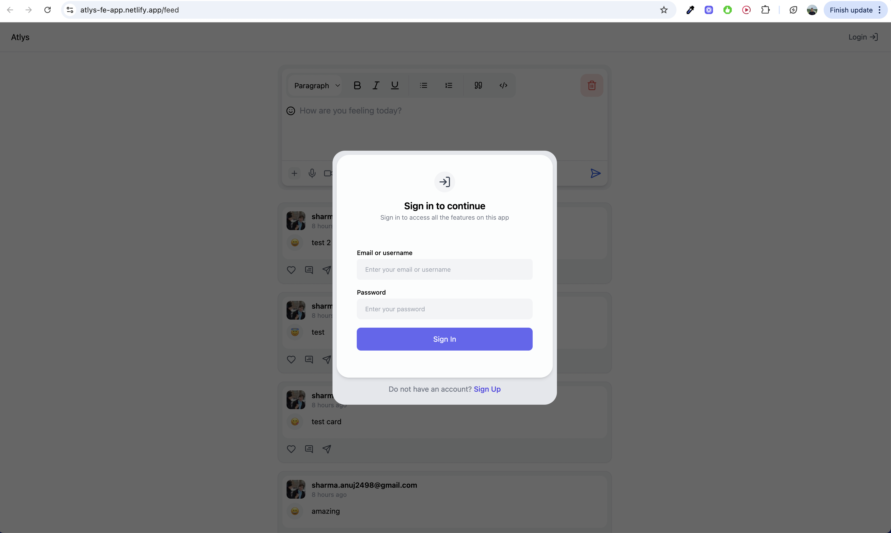
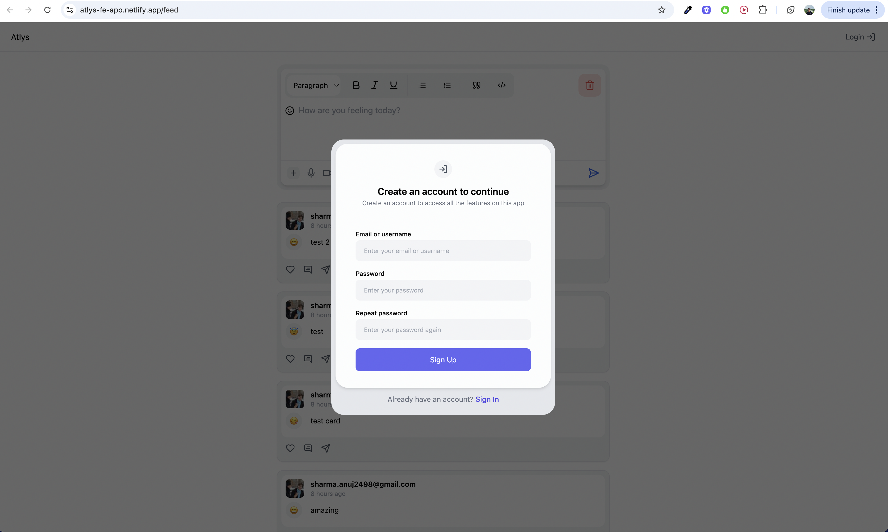
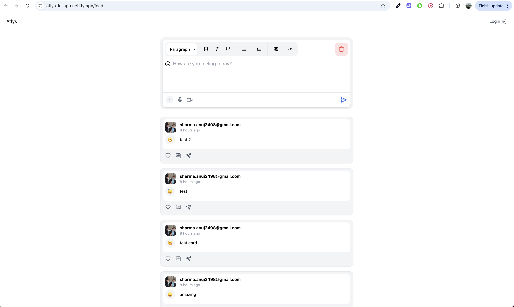
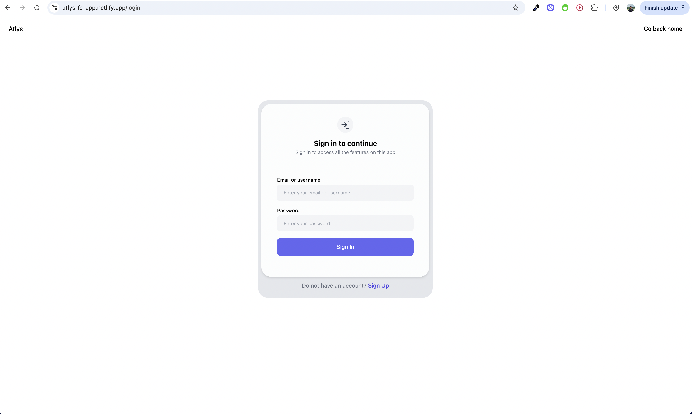
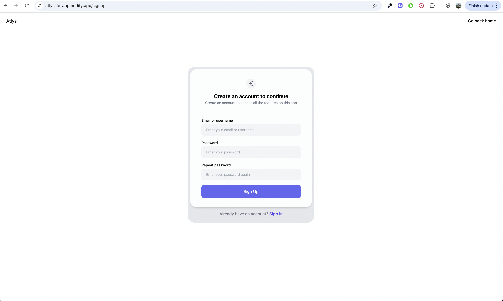

# atlys
Mini app for atlys

## 🛠️ Features

- Sign In / Sign Up modal
- Feed page for all posts
- Post creation and listing with animated transitions
- State management via Redux
- persisting post in localStorage
- Responsive UI with Tailwind CSS

## 📸 Screenshots / Link

- Live app: [https://atlys-fe-app.netlify.app/](https://atlys-fe-app.netlify.app/)

- 
- 
- 
- 
- 

## 🧑‍💻 Getting Started

1. **Clone the repository**  
   `git clone https://github.com/krishnath-24/atlys.git`

2. **Install dependencies**  
   `npm install`

3. **Run the development server**  
   `npm run dev`

4. Visit `http://localhost:3000` in your browser.

## 📦 Tech Stack

- React
- Redux Toolkit
- Tailwind CSS
- Framer Motion
- Emoji Picker
- react toast